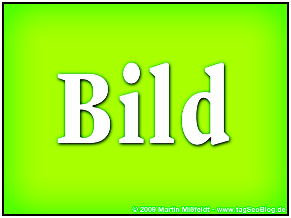

# Heading 1
This is a simple example.
## Heading 2

This is a HTML snippet

---
[Link to Google](http://www.google.ch)
##### Heading to test anchor
[LINK TO PAGE 2](page2.md)
#### Table with first line header
Mock Table
|Data|Data|Data|Data|Data|
|---|---|---|---|---|
|Data|Data|Data|Data|Data|
|Data|Data|Data|Data|Data|
|Data|Data|Data|Data|Data|
|Data|Data|Data|Data|Data|

---
#### Table without first line header
Mock Table
||||||
|---|---|---|---|---|
|Data|Data|Data|Data|Data|
|Data|Data|Data|Data|Data|
|Data|Data|Data|Data|Data|
|Data|Data|Data|Data|Data|
|Data|Data|Data|Data|Data|

---
{:height="350" width="350"}
* Element1
* Element2
* Element3

1. Element1
2. Element2
3. Element3

---
test text paragraph. _This is italic_ and **This is bold**, _this is **bold** in italic_ and **this is _italic_ in bold**
[Link to heading](#8)

